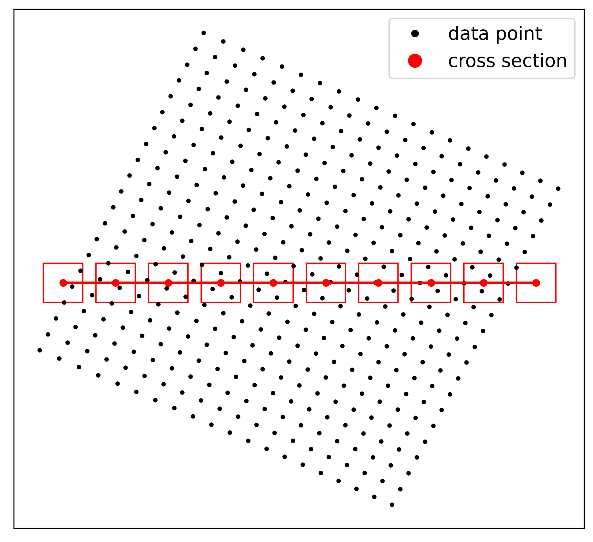
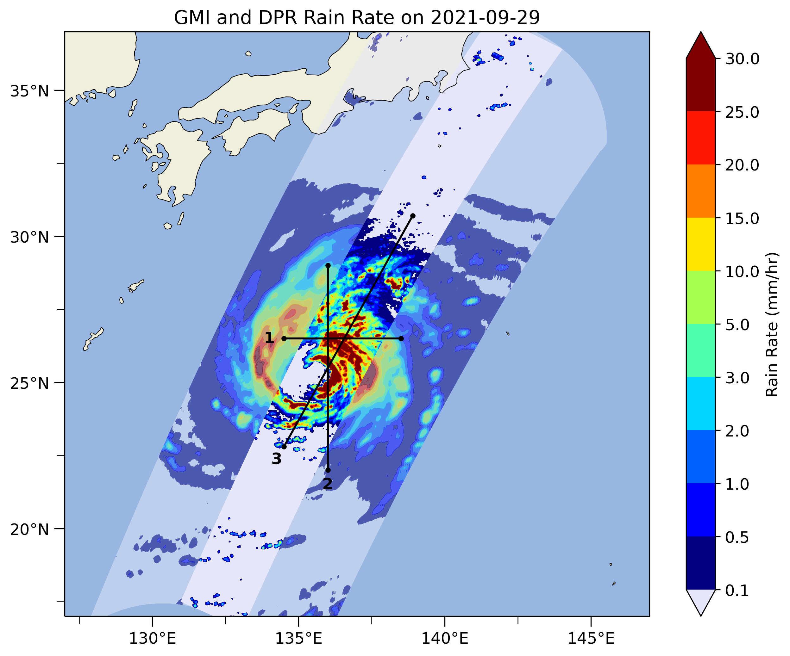
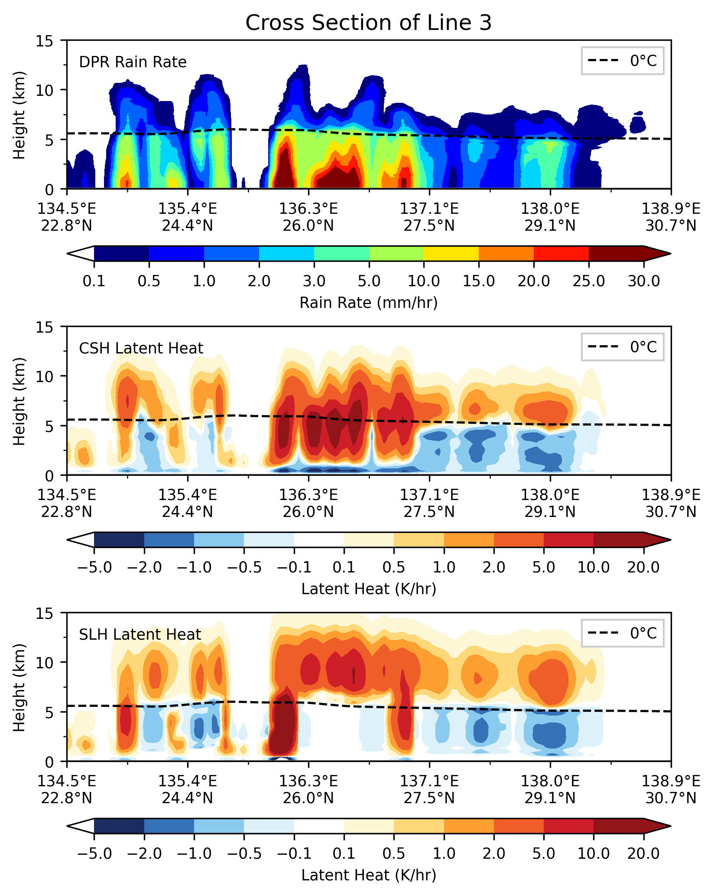

# gpm-dpr-visualization

Example code to visualize GPM-DPR L2 product.

Some groups and datasets in the 2A-DPR file have been removed to reduce file size.

For details, see

[Python绘制GPM DPR二级降水和潜热](http://bbs.06climate.com/forum.php?mod=viewthread&tid=102688)

